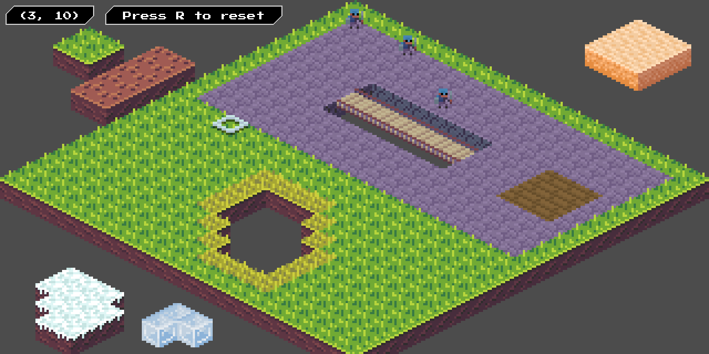
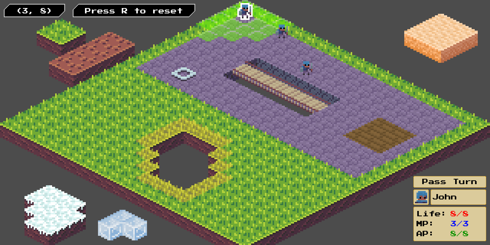
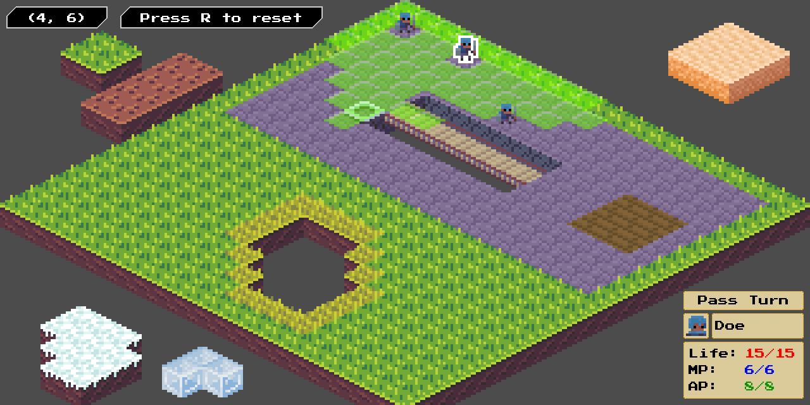
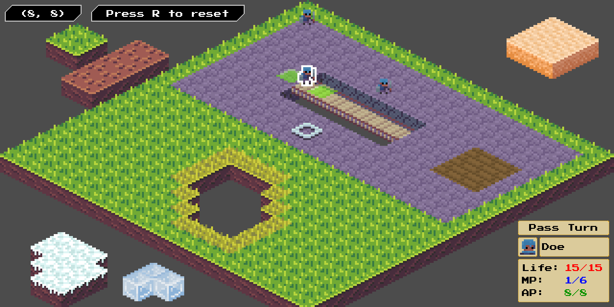

# Isometric Test

Little demo about an isometric system with some units and some kind of turn based pace.

## Screenshots

## Installation

You should import it on Godot Engine. This project is just a test and it is unfinished.

## Credits

Assets: https://opengameart.org
